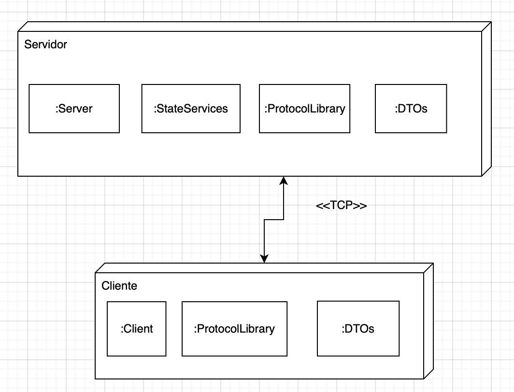

#  Documentación del primer obligatorio

## Autores

* Federico Carbonell - 224359
* Juan Pablo Sobral - 192247

## Manual de usuario

1. Iniciar aplicación Server.
 - Ejecutar server.exe.
2. Iniciar aplicación Client.
 - Ejecutar client.exe
3. Utilizar la aplicación
 - [Comandos disponibles](#comandos)

## Alcance

### Cliente

* RF1 - Conexión y desconexión al servidor.

    El cliente se conecta al servidor de manera automática al iniciarse la aplicación. Se puede desconectar con la opción 0 del menú principal, cerrando así también la aplicación.

* RF2 - Publicación de juego.
    
    Opción 1 del menú del cliente. Luego de dado de alta al juego se notifica al cliente con un mensaje del lado del servidor. Se puede chequear la adición haciendo uso de la opción 6 del menú (ver todos).

    Por esta iteración, no tenemos muchos chequeos sobre los datos recibidos del lado del servidor, lo cual puede llegar a llevar a problemas con las carátulas dado que se asume que los nombres de los juegos van a ser únicos, y por lo tanto guardamos las carátulas del lado del servidor como nombreJuego.jpg .

* RF3 - Baja y modificación de juego.

    Opciones 2 y 3 del menú del cliente. Si el juego está en el sistema, modifica sus datos con los recibidos o lo marca como borrado.

* RF4 - Búsqueda de juegos.

    Opción 7 del menú del cliente. Se puede buscar por nombre del juego, el cual retorna matches parciales. Se puede buscar por categoría, que retorna solo matches absolutos. Se puede buscar por calificación, se retornan juegos con promedio de calificaciones >= al parámetro de búsqueda.

    Importante a la hora de probar búsqueda por calificación, tener en cuenta que los juegos que aún no han sido calificados tienen una calificación nula, es decir, no van a ser tenidos en cuenta a la hora de evaluar los juegos que cumplan con la condición.

* RF5 - Calificación de un juego.

    Opción 4 del menú del cliente. Se permite calificar juegos, luego podemos verificar que la calificación quedó registrada de manera exitosa en el detalle del juego calificado.

* RF6 - Detalle de un juego.

    Opción 5 del menú del cliente. Se busca por id del juego, el cual se puede obtener utilizando la opción de listar todos. Nos trae toda la información del juego disponible en el servidor, incluida la lista de las calificaciones obtenidas con sus respectivos comentarios.

    La funcionalidad de la descarga de la carátula no se implementa dado que se recibió instrucción de dejarlo para próxima iteración, pero sería relativamente sencillo, replicando de manera inversa el envío realizado del cliente al servidor.

### Servidor

* RF1 - Aceptar pedidos de conexión de un cliente.

    El servidor acepta varias conexiones en paralelo, y se maneja perfectamente respecto al acceso a datos.

* RF2 - Ver catálogo de juegos.

    El servidor permite ver el catálogo de juegos desde cualquier cliente, más allá de que se hayan realizado las adiciones en uno y la lectura en otro.

* RF3 - Adquirir un juego.

    Este requerimiento queda para próxima iteración dado que se decidió dejar directamente el manejo de usuarios para otra iteración.

* RF4 - Publicar un juego.

    Una vez publicado un juego, se puede verificar la creación del mismo desde otro cliente sin problemas.

* RF5 - Publicar una calificación de un juego.

    Al igual que con los juegos, una vez publicada de manera exitosa la calificación se puede verificar desde otro cliente sin problemas.

* RF6 - Buscar juegos.

    Al igual que con el resto de las funcionalidades, dado que podemos ver el catálogo también podemos filtrar el mismo.

* RF7 - Ver detalle de un juego.

    Funciona de manera correcta igual que la anterior. No se permite la descarga de carátula aún pero la adición de esta funcionalidad no debería ser compleja.

## Manejo de paralelismo y concurrencia

Este fue el principal desafío encontrado en este obligatorio. Nos decantamos por la utilización de una clase ServerState que almacenase el estado del servidor durante su ejecución en memoria. Esta clase es estática y aplica el patrón Singleton, al cual le agregamos el uso de una serie de locks para asegurar la integridad de las operaciones sobre la misma. Las operaciones de lectura sobre las listas  de entidades de dominio son de libre acceso, mientras que las de escritura sobre las mismas tienen un lock individual (ej, si el cliente A está escribiendo a la lista de reviews, el cliente B puede al mismo tiempo escribir a la lista de usuarios).

## Protocolo utilizado
El protocolo que utilizamos es muy similar al descrito en la letra del obligatorio:

* Es orientado a caracteres.
* Esta implementado sobre TCP/IP.
* Valores alineados a la izquierda, bytes de relleno tienen valor 0.
* Campos HEADER, CMD, LARGO van con largo fijo, DATOS tiene largo variable segun valor indicado en largo.
* Formato general de la trama

Para la serializacion y deserializacion de los datos, utilizamos la siguiente metodologia:
* Calculamos largo del dato a insertar
* Pasamos a bytes este valor
* Pasamos a bytes el dato a insertar
* Insertamos en el array de datos los bytes del valor seguidos por los bytes del dato

Esto nos permite luego hacer una lectura precisa del lado del servidor. Supongamos que quisieramos enviar un dato que vale 1567.

En ese caso, nuestra trama de datos tendria el siguiente formato => |4|0|0|0|1|5|6|7|

Al querer deserializar los datos el servidor, comienza a leer sabiendo que los primeros 4 bytes se corresponden al largo del dato. Luego, asigna al dato el valor correspondiente a la deserializacion de los siguientes cuatro bytes.

## Arquitectura

La arquitectura del sistema esta compuesta por un servidor y un cliente, ellos se comunicaran mediante el protocolo TCP. Como se menciono previamente, se pueden conectar diversos clientes al mismo servidor.
Los ejecutables mencionados se pueden deployar en un mismo host, no es necesario tenerlo en separados hosts.

- El servidor se compone por:
  - Server.dll
  - StateServices.dll
  - ProtocolLibrary.dll
- El cliente se compone por:
  - Client.dll
  - ProtocolLibrary.dll

## Comandos

Desde el lado del cliente existen los siguientes comandos:

0. Desconectar cliente.
1. Agregar juego.
2. Eliminar juego.
3. Modificar juego.
4. Calificar juego.
5. Ver detalles de un juego.
6. Ver todos los juegos.
7. Buscar juegos.
8. Ver juegos comprados.
9. Comprar juego.

Desde el lado del servidor existe un unico comando:

0. Desconectar servidor.